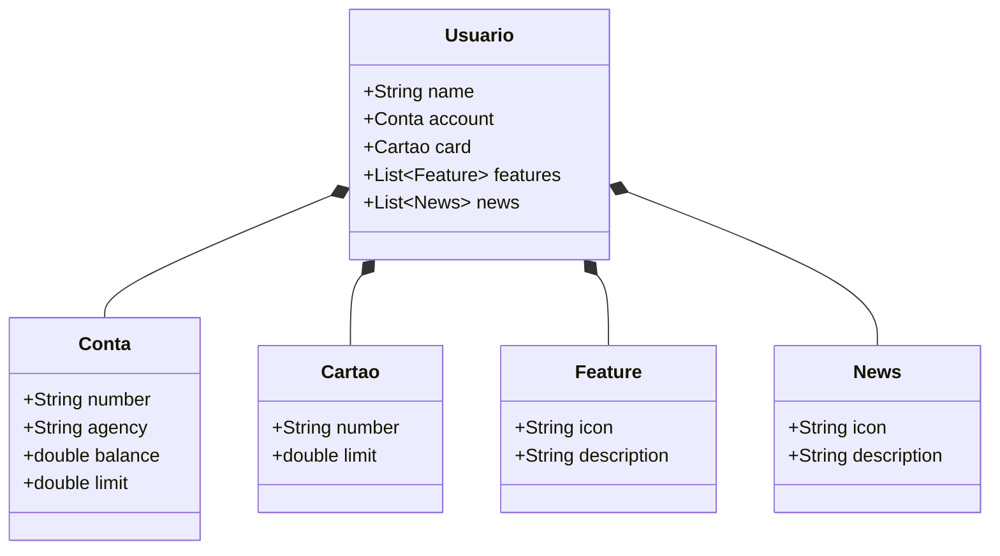

# DIO Project

## Diagrama de Classes

```mermaid
classDiagram
    class Usuario {
        +String name
        +Conta account
        +Cartao card
        +List~Feature~ features
        +List~News~ news
    }

    class Conta {
        +String number
        +String agency
        +double balance
        +double limit
    }

    class Cartao {
        +String number
        +double limit
    }

    class Feature {
        +String icon
        +String description
    }

    class News {
        +String icon
        +String description
    }

    Usuario *-- Conta
    Usuario *-- Cartao
    Usuario *-- Feature
    Usuario *-- News
```
